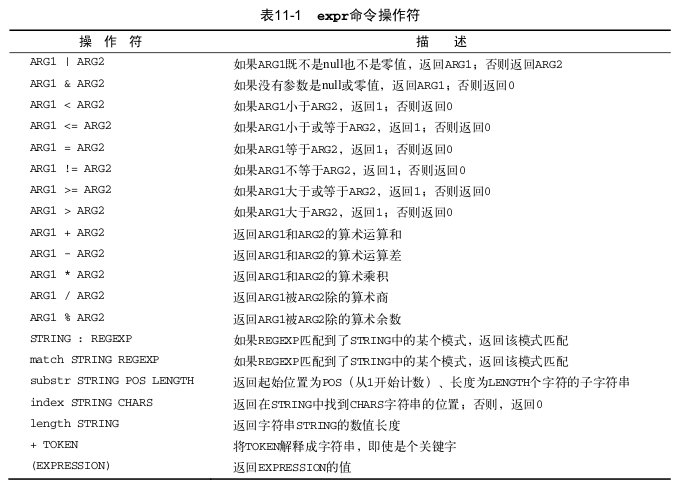

			shell脚本中有２种途径来进行数学运算：

# 11.7.1	expr命令

​			Bourne shell提供了一个特别的命令用于处理数学表达式。expr命令允许在命令行上处理数学表达式。expr命令能够识别少数的数学核字符串操作符。见表11-1



​			尽管标准操作符在expr命令中工作得很好，但在脚本或命令行上使用它们仍有问题出现。许多expr命令操作符在shell中另有含义(比如*号)。出现在expr命令中会出现诡异的结果，所以需要将那些容易被shell错误解释的字符，在它们传入expr命令之前，需要使用shell的转义字符(反斜线 \ )标识出来

要将一个数学算式的结果赋给一个变量,需要使用命令替换来获取 expr 命令的输出:

```
var1=10
var2=20
var3=$(expr $var2 / $var1)
```


# 11.7.2　使用方括号

​			bash shell保持跟Bourne shell的兼容而包括了expr 命令,但它同样也提供了一种更简单的方法来执行数学表达式。在bash中,在将一个数学运算结果赋给某个变量时,可以用\$和方括号[]　\$[operation] 将数学表达式围起来。

```
var1=100
var2=45
var3=$[$var1 / $var2]
```

bash shell数学运算符只支持整数运算，若要进行任何实际数学计算，是一个限制。


# 11.7.3 浮点解决方案

​			有几种解决方案客服bash中数学运算的整数限制。最常见用内建的bash计算器，bc


## 1.bc基本用法

​			bash计算器其实是一种编程语言，它允许在命令行中输入浮点表法式，然后解释并计算该表达式，最后返回结果。

bash能够识别：

- 数字(整数和浮点数)
- 变量(简单变量和数组)
- 注释(以#或C语言中的 /* */ 开始的行)
- 表达式
- 编程语句( 如 if-then语句)
- 函数

使用

```
bc
```

命令访问bash计算器，若要退出bash计算器,使用命令

```
quit
```

​			浮点运算是由内建变量scale控制的，必须将这个值设置为你希望在计算结果中保留的小数位数，否则无法得到期望的结果，因为scale默认值为0。例如

```
bc
scale=4
3.14/5
```

​			bash计数器还能支持变量，变量一旦被定义，整个bash计算器会话中都能使用该变量。print 语句允许打印变量核数字

```
bc -q
var1=10
var1 * 4
40
var2 = var1 / 5
print var2
2
quit
```

## 2.在脚本中使用bc

​			bash计算器通过命令替换，和管道运行bc命令，并将输出赋给一个变量，在shell脚本中帮助处理浮点运算的。基本格式：

```
variable=$(echo "options; expression" | bc)
```

第一部分options允许你设置变量。如果你需要设置不止一个变量，可以用分号将其分开。expression参数定义了通过bc执行的数学表达式。

​			如果需要大量运算，在一个命令行中列出多个表达式就会有点麻烦。bc命令能识别输入重定向，允许将一个文件重定向到bc命令来处理，但由于要把表达式存放在文件中过于麻烦，最好办法是使用内联输入重定向，允许你直接在命令行中重定向数据。在shell脚本中，将输出赋给一个变量。

```
variable=$(bc << EOF
options
statements
expressions
EOF
)
```

EOF文本字符标识了内联重定向数据的起止。仍然要命令替换符号将bc命令的输出赋给变量。如下：

```
#!/bin/bash
var1=10.46
var2=43.67
var3=33.2
var4=71
var5=$(bc << EOF
scale = 4
a1 = ( $var1 * $var2)
b1 = ($var3 * $var4)
a1 + b1
EOF
)
echo The final answer for this mess is $var5
```

在这里注意：**expressions，表达式里代表变量不需要在变量名前再加一个\$符号，否则会报syntax error，语法错误；可在bash计算器中赋值给变量，但是创建出来的变量只带bash计算器中有效，不能在shell脚本中使用**。