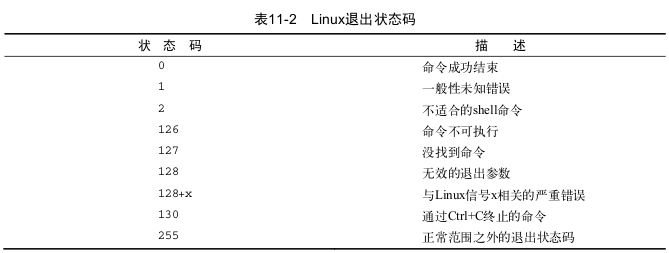

​			shell中运行的每个明林都使用**退出状态码(exit status)**告诉shell它已经运行完毕。退出状态码是一个0~255的整数值，在命令结束运行时由命令传给shell。可以捕获这个值并在脚本中使用。

# 11.8.1　查看退出状态码

​			Linux提供了一个专门的变量 \$? 来保存上个已执行命令的退出状态码。对于需要进行检查的命令，必须在其运行完毕后立即查看或使用 \$? 变量。它的值会变成由shell所执行的最后一条命令的退出状态码

​			一个成功结束的命令的退出状态码是0，如果一个命令结束有错误，退出状态码就是一个正数值。

如:

```
date
echo $?

asdfg
echo $?
```

​			如表11-2所示，提供了一些Linux错误退出状态码




# 11.8.2	exit 命令

​			默认情况下,shell脚本会以脚本中的最后一个命令的退出状态码退出，可以改变默认行为，返回自己的退出状态码。exit命令允许在脚本结束时制定一个退出状态码。也可以在exit命令中使用变量，若指定的变量不在0~255区间，shell通过模运算得到结果(一个值的模就是被除后的余数)，最终指定的结果就是指定数值除以256得到的余数。可以用if-then语句检查某个命令返回的错误状态。

```
exit 66
```

```
exit $var
```

