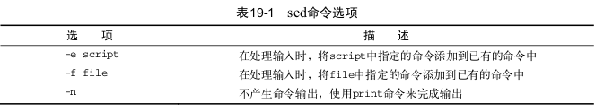

# 19.1　文本处理

​			轻松实现自动格式式化、插入、修改或删除文本元素的简单命令行编辑器
就方便多了。
​			Linux系统提供了２个常见的具备上述功能的工具。本节将会介绍Linux世界中最
广泛使用的２个命令行编辑器:sed和gawk。


## 19.1.1　sed编辑器

​			sed编辑器被称为流编辑器(stream editor)，和普通的交互式文本编辑器恰好相反。在交互式文本编辑器中(比如vim)，你可以用键盘命令来交互式地插入、 删除或替换数据中的文本。流编辑器则会在编辑器处理数据之前基于预先提供的一组规则来编辑数据流。

​			sed编辑器可以根据命令来处理数据流中的数据，这些命令要么从命令行中输入，要么存储在一个命令文本文件中，sed编辑器会执行下列操作：

- 一次从输入中读取一行数据
- 根据所提供的编辑器命令匹配数据
- 按照命令修改流中的数据
- 将新的数据输出到 STDOUT


​			在流编辑器将所有命令与一行数据匹配完毕后，它会读取下一行数据并重复这个过程。在流编辑器处理完流中的所有数据行，它就会终止。

​			由于命令是按顺序逐行给出的，sed编辑器只需要对数据流进行一遍处理就可以完成编辑操作。sed命令格式如下：

```
sed options script file
```

​			选项允许你修改sed的命令的行为，可以使用的选项已在表19-1中列出



​			script参数指定了应用于流数据上的单个命令。如果需要使用多个命令，要么使用-e选项在命令行中指定，要么使用-f选项在单独的文件中指定。

​			1.在命令行定义编辑器命令

​				默认情况下，sed编辑器会将指定的命令应用到STDIN输入流。你可以直接将数据通过管道输入sed编辑器处理，例如：

```
echo "This is a test" | sed 's/test/big test/'
```

这个例子在sed编辑器中使用了 s 命令。 s 命令会用**斜线间**指定的第二个文本字符串来替换第一个文本字符串模式。

​				重要的是,sed编辑器并不会修改文本文件的数据。它只会将修改后的数据发送到STDOUT 。如果你原来的文本文件,它仍然保持着原始数据。

​			2.在命令行使用多个编辑器命令

​				要在sed命令行上执行多个命令时，只要用-e选项就行。例如：

```
sed -e 's/brown/green/; s/dog/cat/' data1.txt
```

​				两个命令都作用到文件中的每行数据上。命令之间用分号开,并且在命令
末尾和分号之间不能有空格。

​				如果不想用分号 ,也可以用bash shell中的次提示符来分隔命令。只要输入第一个单引示号标示出sed程序脚本的起始(sed编辑器命令列表),bash会继续提示你输入更多命令,直到输入了标示结束的单引号。

```
sed -e '
> s/brown/green/
> s/fox/elephant/
> s/dog/cat/' data1.txt
```

​				要在封尾单引号所在行结束命令。bash shell一旦发现了封尾的单引号，就会执行命令。开始后，sed命令就会将你指定的每一条命令应用到文本文件的每一行上。

​			3.从文件中读取编辑器命令

​				如果有大量要处理的 sed 命令,那么将它们放进一个单独的文件中通常会更方便一些。可以在 sed 命令中用 -f来指定文件。例如：

```
$ cat script1.sed
s/brown/green/
s/fox/elephant/
s/dog/cat/
$
$ sed -f script1.sed data1.txt
The quick green elephant jumps over the lazy cat.
The quick green elephant jumps over the lazy cat.
The quick green elephant jumps over the lazy cat.
The quick green elephant jumps over the lazy cat.
```

​				在这种下,不用在每个命令后面放一个分号 。sed编辑器知道每行都是一条单独的命令。跟在命令行输入命令一样，sed编辑器会从指定文件中读取命令，并将它们应用到数据文件中的每一行上。

PS：很容易将sed编辑器脚本文件核bash shell脚本文件弄混。可以使用.sed作为sed脚本文件的扩展名