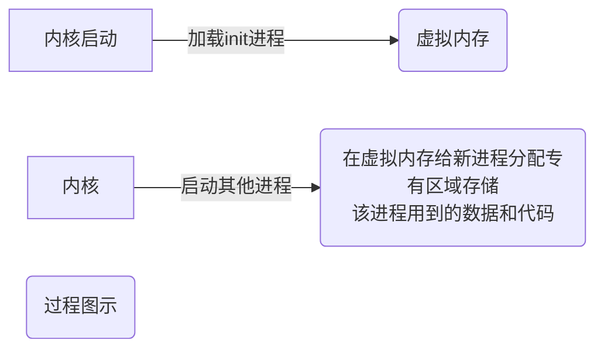

## 1.1.1 深入探究Linux内核

​		内核主要负责以下四种功能:

​			(1)系统内存管理：不仅管理服务器上的可用物理内存，还可以创建和管理虚拟内存[内核通过硬盘上的存储空间来实现虚拟内存，此块区域(划分出来的存储空间)称为**交换空间(Swap Space)**]，

​			　内核不断地在交换空间和实际的物理内存之间反复交换虚拟内存中的内容。使得系统以为它拥有比物理内存更多的可用内存。

　			虚存是对物理内存的抽象，虚存使用lru的机制将物理内存中不经常使用的部分写入磁盘，通过这种方式来扩展系统的可用内存。当系统需要访问写入磁盘的部分时，系统会触发一个缺页异常将写入磁盘的部分写回物理内存。

​			　交换内存或交换空间是虚存使用的一部分物理硬盘。

​			　虚存是操作系统为了更高效的使用物理内存提出的概念，应用程序操作的地址是虚存的地址(对应地址空间的概念)，内核提供将虚存地址翻译为物理内存地址的功能。

​			　虚存这一概念的提出提高了系统对于物理内存的使用率。虚存由物理内存和一部分磁盘空间组成。

​			　交换空间对应着虚存中的用来临时存储物理内存中内容的磁盘空间。当系统的物理内存不够时，我们才使用交换空间。

​			　以Linux 操作系统为例，内核将使用页的方式来管理物理内存，内核维持了一张表来记录每一页存储在物理内存还是被交换到交换空间，通过lru 的机制将很长时间没被使用的页写入到交换空间，这个进程被称作swaping out，当需要访问交换到交换空间中的部分时，通过缺页异常的方式将相应部分调入物理内存。综上，交换空间这一概念是因虚存这一技术而提出。

​			　内存存储单元按组划分为许多块，这些块叫页面，内核将每个内存页面放在物理内存或交换空间，内核维护的内存页面表指明页面的位置，指明哪些页面位于物理内存或者被换到磁盘上。内核会记录哪些内存页面正在使用中,并自动把一段时间未访问的内存页面复制到交换空间区域(该过程称为换出,swapping out)，即使还有可用内存－－当程序要访问一个已被换出的内存页面时，内核必须从物理内存换出另外一个内存页面给它让出空间，然后从交换空间换入请求的内存页面。显然 ,这个过程要花费时间,拖慢运行中的进程。只要Linux系统在运行,为运行中的程序换出内存页面的过程就不会停歇。

​			(2)软件程序管理：Linux操作系统将运行中的程序称为**进程**。内核控制Linux系统如何管理运行在系统上的所有进程。内核创建了第一个进程(**init进程**)来启动系统上所有其他进程。

​			　一些Linux发行版使用一个表来管理在系统开机时要自动启动的进程。在Linux系统上,这个表通常位于文件/etc/inittab中。一些系统(比如现在流行的Ubuntu Linux发行版)则采用/etc/init.d,将开机时启动或某个应用的脚本放在这个下。这些脚本通过/etc/rcX.d下的入 (entry) 启动,这的X代表运行级 (run level)。init进程，它是一个由内核启动的用户级进程。内核会在过去曾使用过init的几个地方查找它，它的正确位置（对Linux系统来说）是/sbin/init。如果内核找不到init，它就会试着运行/bin/sh，如果运行失败，系统的启动也会失败。

​			　运行级就是操作系统当前正在运行的功能级别。这个级别从0到6 ，具有不同的功能。

​		　　级别具体说明：

| 运行级别                    |                           具体说明                           |
| :-------------------------- | :----------------------------------------------------------: |
| 0：关机,停机模式            | 0： 系统停机（关机）模式，系统默认运行级别不能设置为0，否则不能正常启动，一开机就自动关机。 |
| 1：单用户模式               | 1：单用户模式，root权限，用于系统维护，禁止远程登陆，就像Windows下的安全模式登录。 |
| 2：多用户模式               |               2：多用户模式，没有NFS网络支持。               |
| 3：完整的多用户文本模式     | 3：完整的多用户文本模式，有NFS，登陆后进入控制台命令行模式。 |
| 4：系统未使用，保留一般不用 | 4：系统未使用，保留一般不用，在一些特殊情况下可以用它来做一些事情。例如在笔记本电脑的电池用尽时，可以切换到这个模式来做一些设置。 |
| 5：图形化模式               | 5：图形化模式，登陆后进入图形GUI模式或GNOME、KDE图形化界面，如X Window系统。 |
| 6：重启模式                 | 6：重启模式，默认运行级别不能设为6，否则不能正常启动，就会一直开机重启开机重启。 |

​			(3)硬件设备管理：

​			　任何Linux系统需要与之通信的设备,都需要在内核代码中加入其驱动程序代码。驱动程序代码相当于应用程序和硬件设备的中间人，允许内核与设备之间交换数据。在Linux内核中，有２种方法用于插入设备驱动代码:

- ​		编译进内核的设备驱动代码
- 　　可插入内核的设备驱动代码			

​			　早先插入内核的设备驱动代码唯一途径是重新编译内核每次系统添加新设备,都要重新编译一次内核代码。后来提出内核模块的概念：它允许将驱动代码插入到运行中的内核而无需重新编译内核。同时,当设备不再使用时也可将内核模块从内核中移除。

​			　Linux系统将硬件设备当成特殊的文件, 称为**设备文件**，有３种分类：

| 设备文件分类   | 说明                                                         |
| -------------- | ------------------------------------------------------------ |
| 字符型设备文件 | 处理数据时每次只能处理一个字符的设 。大多数的调制，解调器和终端都是作为字符型设备文件创建的。 |
| 块设备文件     | 处理数据时每次能处理大块数据的设 ,比如硬盘                   |
| 网络设备文件   | 采用数据包发送和接收数据的设备,包括各种网卡和一个特殊的回环设备。这个回环设备允许Linux系统使用常见的网络编程协议同自身通信 |

​			　Linux为系统上的每个设备都创建一种称为**节点**的特殊文件。与设备的所有通信都通过设备节点完成。每个节点都有唯一的数值对供Linux内核标识它。数值对包括一个主设备号和一个次设备号。类似的设备被划分到同样的主设备下。次设备号用于标识主设备组下的某个特定设备。

​			　(4)文件系统管理

​				　Linux内核支持通过不同类型的文件系统从硬盘中读写数据。除了自有的诸多文件系统 ,Linux还支持从其他操作系统(比如Microsoft Windows)采用的文件系统中读写数据。内核在编译时就加入对所有可能用到的文件系统的支持。表1-1列出了Linux系统用来读写数据的标准文件系统。

​			　Linux服务器所访问的所有硬盘都必须格式化成表1-1所列文件系统中的一种。Linux内核采用虚拟文件系统(Virtual File System,VFS)作为和每个文件系统交互的接口。这为Linux内核同任何类型文件系统通信提供了一个标准接口。当每个文件系统都被挂载和使用时,VFS将信息都缓存在内存中。

## 1.1.2 GNU工具

​			GNU组织(GNU是GNU’s Not Unix的 写)开发了一套完整的Unix工具，但没有可以运行它们的内核系统。

​			(1)核心GNU工具：

​				GNU供Linux系统使用的这组核心工具被称为coreutils(core utilities)软件包，该软件包由三部分构成：

- 　　　用以处理文件的工具
- 　　　用以操作文本的工具
- 　　　用以管理进程的工具

​			(2)shell：

​			　GNU/Linux shell 是一种特殊的交互式工具。它为用户提供了启动程序、管理文件系统中的文件以及运行在Linux系统上的进程的途径。shell的核心是命令行提示符。命令行提示符是shell负责交互的部分。它允许你输入文本命令, 然后解释命令,并在内核中执行。

​			　shell包含了一组内部命令,用这些命令可以完成诸如复制文件、移动文件、 命 文件、显示和终止系统中正运行的程序等操作。shell也允许你在命令行提示符中输入程序的名称，它会将程序名传递给内核以启动它。

​			　你也可以将多个shell命令放入文件中作为程序执行。这些文件作**shell脚本**。你在命令行上执行的任何命令都可放进一个shell脚本中作为一组命令执行。这为创建那种需要几个命令放在一起来工作的工具提供了便利。

​			　在Linux系统上,通常有好几种Linux shell可用。不同的shell有不同的特性,有些更利于创建脚本,有些则更利于管理进程。所有Linux发行版默认的shell都是bash shell。bash shell 由GNU项目开发, 被当作标准Unix shell——Bourne shell(以创建者的名字命名)的替代品 。表1-2列出了Linux中常见的几种不同shell。

