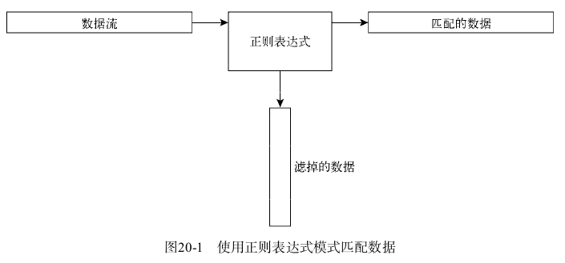

# 20.1　什么是正则表达式


## 20.1.1　定义

​			正则表达式是你所定义的模式模板(pattern template)，Linux工具可以用它来过滤文本。Linux工具(比如sed编辑器或gawk程序)能够在处理数据时使用正则表达式对数据进行模式匹配。如果数据匹配模式，它就会被接受并进一步处理；如果数据不匹配模式，它就会被过滤掉。图20-1描述这个过程：



​			正则表达式模式利用通配符来描述数据流中的一个或多个字符。Linux中有很多场景都可以使用通配符来描述不确定的数据。例如：ls命令中使用通配符列出文件和目录的例子

​			星号通配符允许你只列出满足特定条件的文件：

```
ls -al da*
```

da*参数会让ls命令只列出名字以da开头的文件。文件名中da之后可以有任意多个字符(包括什么都没有)。ls命令会读取目录中所有文件的信息，但只列出跟通配符匹配的文件的信息。

​			正则表达式通配符模式的工作原理与之类似。正则表达式含有文本或特殊字符，为sed编辑器和gawk程序定义了一个匹配数据时采用的模板。


## 20.1.2　正则表达式的类型

​			使用正则表达式最大的问题在于有不止一种类型的正则表达式。Linux中的不同应用程序可能会用不同类型的正则表达式。这其中包括编程语言(JAVA、Perl和Python)、Linux实用工具(sed编辑器、gawk程序和grep工具)以及主流应用(比如MySQL和PostgreSQL数据库服务器)。

​			正则表达式是通过正则表达式引擎(regular expression engine)实现的。正则表达式引擎是一套底层软件，负责解释正则表达式并使用这些模式进行文本匹配。

​			在Linux中,有2种流行的正则表达式引擎:

- POSIX基础正则表达式(basic regular expression,BRE)引擎
- POSIX扩展正则表达式(extended regular expression,ERE)引擎

​			大多数Linux工具都至少符合POSIX BRE引擎规范,能能够识别该规范定义的所有模式符号。遗憾的是，有些工具(比如sed编辑器)只符合BRE引擎规范的子集(出于速度的考虑，sed希望能够尽快处理数据流中的文本)。
​			POSIX BRE引擎通常出现在依赖正则表达式进行文本过滤的编程语言中。它为常
式提供了高级模式符号和特殊符号，比如匹配数字、单词以及按字母排序的字符。gawk程序用ERE引擎来处理它的正则表达式模式。

​			由于实现正则表达式的方法很多,很难用一个简洁的描述来涵盖所有可能的正则表达式。后续几节将会讨论最常见的正则表达式,并演示如何在sed编辑器和gawk程序中使用它们。


# 20.2　定义BRE模式

​			最基本的BRE模式是匹配数据流中的文本字符。

## 20.2.1　纯文本

​			关键在于将正则表达式模式匹配大数据流文本上。重要的是记住正则表达式对匹配的模式非常挑剔。第一条原则就是：正则表达式模式区分大小写。这意味着它们值会匹配大小写也相符的模式。

​			正则表达式中，你不用写出整个单词。只要定义的文本出现在数据流中，正则表达式

