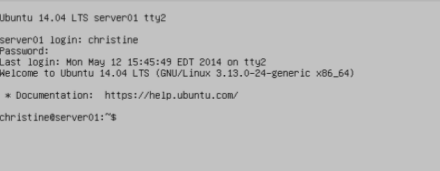
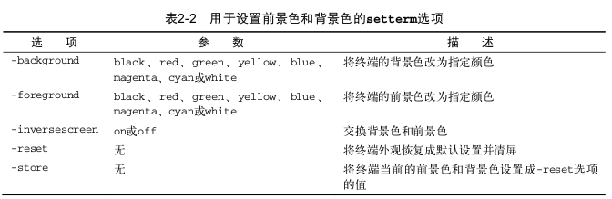

			在大多数Linux发行版中,你可以使用简单的按键组来访问某个Linux虚拟控制台 。通常下Ctrl+Alt组合键, 然后按功能 (F1~F7)进入要使用的虚拟控制台 。功能键F1生成虚拟控制台１,F2 生成控制台2,F3 生成控制台3,F4 生成控制台4,依次类推。

​			Linux 发行版用通常使用Ctrl + Alt 组合键配合F1或F7来进入图形界面。Ubuntu使用F7。

​			

​			在图2-2中第一行文本的最后有一个词tty2(不是所有的发行版都会在登录界面上显示虚拟控制台的tty号)，表明这是虚拟控制台2，tty代表电传打字机(teletypewriter)。这是一个古老的名词，指明这是一台用于发送消息的机器。

​			注意在虚拟控制台中是无法运行任何图形化程序的。一旦登录完成,你可以保此次登录的活动状态，在不中断活动会话的同时切换到另一个虚拟控制台 ，有多个活动会话。在使用CLI时，这个特性为你提供了巨大的灵活性。

​			以下是设置前景色核和背景色的setterm选项：

