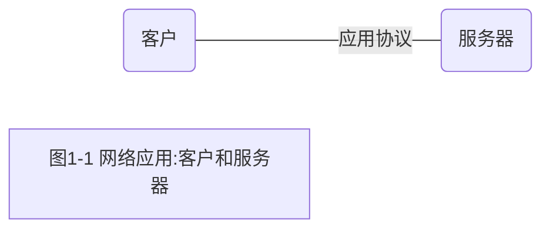
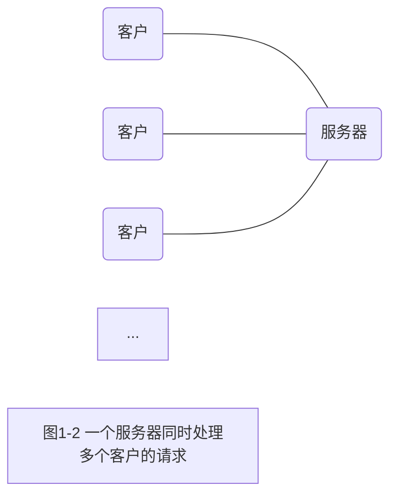

# 1.1　概述

​			要编写通过计算机网络通信的程序要编写通过计算机网络通信的程序，首先要确定这些程序相互通信所用的**协议**（protocol）。在深入设计一个协议的细节之前，应该从高层次决断通信由哪个程序发起以及响应在何时产生。举例来说，一般认为Web服务器程序是一个长时间运行的程序（即所谓的**守护程序**，daemon），它只在响应来自网络的请求时才发送网络消息。协议的另一端是Web客户程序，如某种浏览器，与服务器进程的通信总是由客户进程发起。大多数网络应用就是按照划分成**客户**（client）和**服务器**（server)[①](本书英文原文通篇频繁使用client（客户）和server（服务器）这两个术语。实际上它们的具体含义随上下文而变化，有时指静态的源程序或可执行程序（客户程序和服务器程序），有时指动态进程（客户进程和服务器进程），有时指运行进程的主机（客户主机和服务器主机）。在不致引起混淆的前提下，我们简单地称客户进程为客户，称服务器进程为服务器。)来组织的。

​			在设计网络应用[②](这个术语的具体含义随上下文而变化，有时指程序（应用程序），有时指进程（应用进程），有时作为名词性修饰词译为应用。本书有时把同处应用层的客户和服务器对也用应用表示，我们称之为应用系统、网络应用或应用。)时，确定总是由客户发起请求往往能够简化协议和程序[③](Unix系统中程序（program）和进程（process）是在系统调用`exec`上衔接的。`exec`既可以由shell隐式调用（直接输入命令行执行程序属于这种情况），也可以在用户程序中显式调用。显式`exec`调用执行的程序在本书中称为新程序，以示与`exec`调用所在程序的区别。`exec`调用前后两个程序实际上在同一个进程环境下执行，不过往往使用新程序的名字来称呼这个进程。`exec`调用往往跟在某个`fork`调用之后，这样新程序将在新的进程环境中执行。客户程序和迭代服务器程序运行时通常只有一个进程，并发服务器程序运行时除主进程外，通常还为每个客户派生一个进程。程序和进程的密切关系使得两者有时相互渗透使用，不易区分)本身。当然一些较为复杂的网络应用还需要**异步回调**(asynchron-ous callback)通信，也就是由服务器向客户发起请求消息。然而坚持采纳图1-1所示的基本客户/服务器模型的网络应用毕竟要普遍得多。

​			通常客户每次只与一个服务器通信，不过以使用Web浏览器为例，我们也许在10分钟内就可以与许多不同的Web服务器通信。从服务器的角度来看，一个服务器同时与多个客户通信并不稀奇，见图1-2。

​			可认为客户与服务器之间是通过某个网络协议通信的，但实际上，这样的通信通常涉及多个网络协议层。本书的焦点是TCP/IP协议族，也称为网际协议族。举例来说，Web客户与服务器之间使用TCP（Transmission Control Protocol，传输控制协议）通信。TCP又转而使用IP（Internet Protocol，网际协议）通信，IP再通过某种形式的数据链路层通信。如果客户与服务器处于同一个以太网，就有图1-3所示的通信层次。

​			

