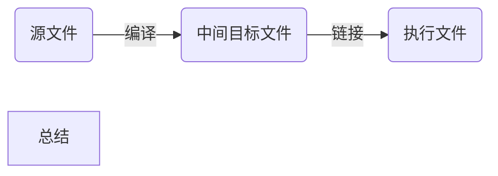

# 第一部分　概述		

​			makefile 关系到了整个工程的编译规则。一个工程中的源文件不计数,其按类型、功能、模块分别放在若干个目录中,makefile 定义了一系列的规则来指定,哪些文件需要先编译,哪些文件需要后编译,哪些文件需要重新编译,甚至于进行更复杂的功能操作,因为
makefile 就像一个 Shell 脚本一样,其中也可以执行操作系统的命令。make 是一个命令工具,是一个解释 makefile 中指令的命令工具,一般来说,大多数的 IDE 都有这个命令,比如:Delphi 的 make,Visual C++的 nmake,Linux 下 GNU 的 make。可见,makefile 都成为了一种在工程方面的编译方法。

# 第二部分　关于程序的编译和链接

​			一般来说,无论是 C、C++、还是 pas,首先要把源文件编译成中间代码文件,在 Windows 下也就是 .obj 文件,UNIX 下是 .o 文件,即 Object File,这个动作叫做编译(compile)。然后再把大量的 Object File 合成执行文件,这个动作叫作链接(link)。编译时,编译器需要的是语法的正确,函数与变量的声明的正确。对于后者,通常是你需要告诉编译器头文件的所在位置(头文件中应该只是声明,而定义应该放在 C/C++文件中),只要所有的语法正确,编译器就可以编译出中间目标文件。一般来说,每个源文件都应该对应于一个中间目标文件(O 文件或是 OBJ 文件)。

​			链接时,主要是链接函数和全局变量,所以,我们可以使用这些中间目标文件(O 文件或是 OBJ文件)来链接我们的应用程序。链接器并不管函数所在的源文件,只管函数的中间目标文件(Object File),在大多数时候,由于源文件太多,编译生成的中间目标文件太多,而在链接时需要明显地指出中间目标文件名,这对于编译很不方便,所以,我们要给中间目标文件打个包,在 Windows 下这种包叫“库文件”(Library File),也就是 .lib 文件,在 UNIX下,是 Archive File,也就是 .a 文件。

​			在编译时,编译器只检测程序语法,和函数、变量是否被声明。如果函数未被声明,编译器会给出一个警告,但可以生成 Object File。而在链接程序时,链接器会在所有的 Object File 中找寻函数的实现,如果找不到,那到就会报链接错误码(Linker Error),在 VC 下,这种错误一般是:Link 2001 错误,意思说是说,链接器未能找到函数的实现。你需要指定函数的Object File.